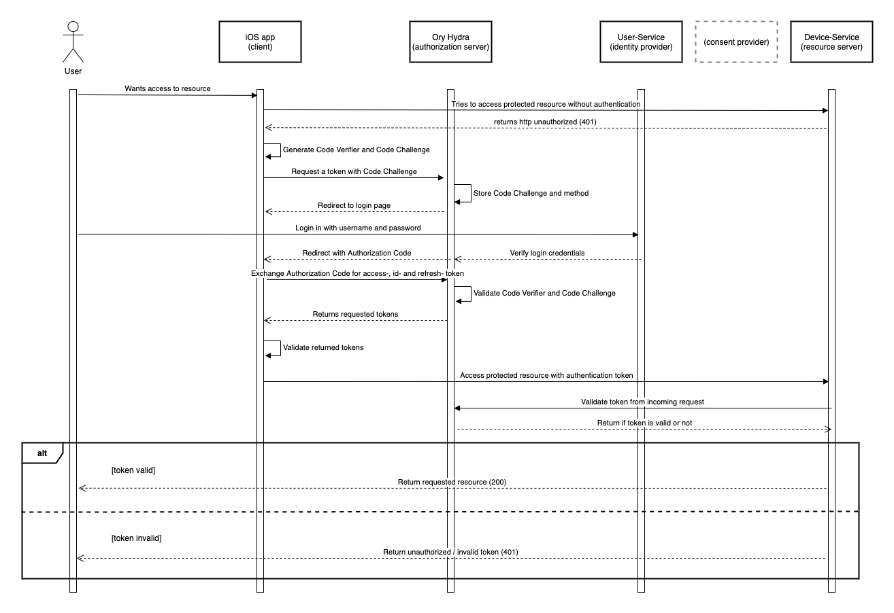
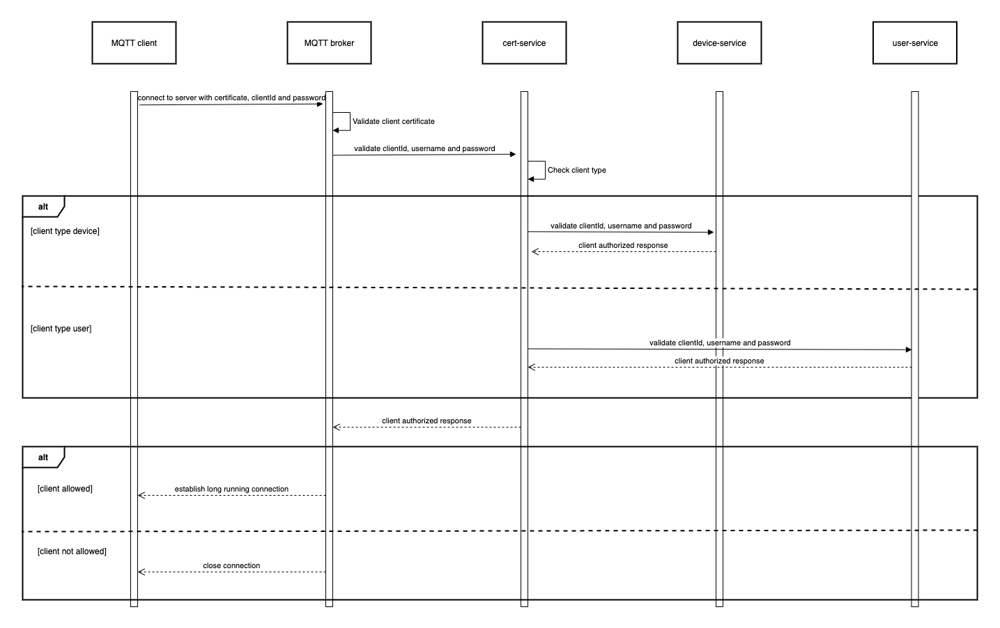
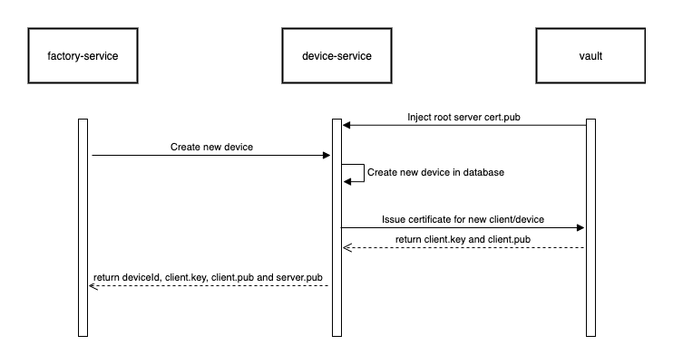
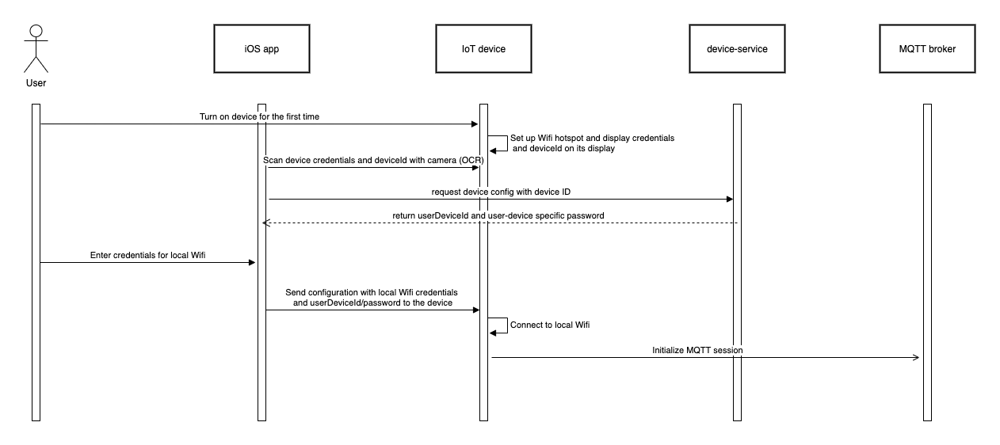
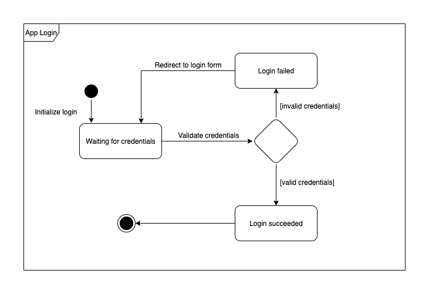
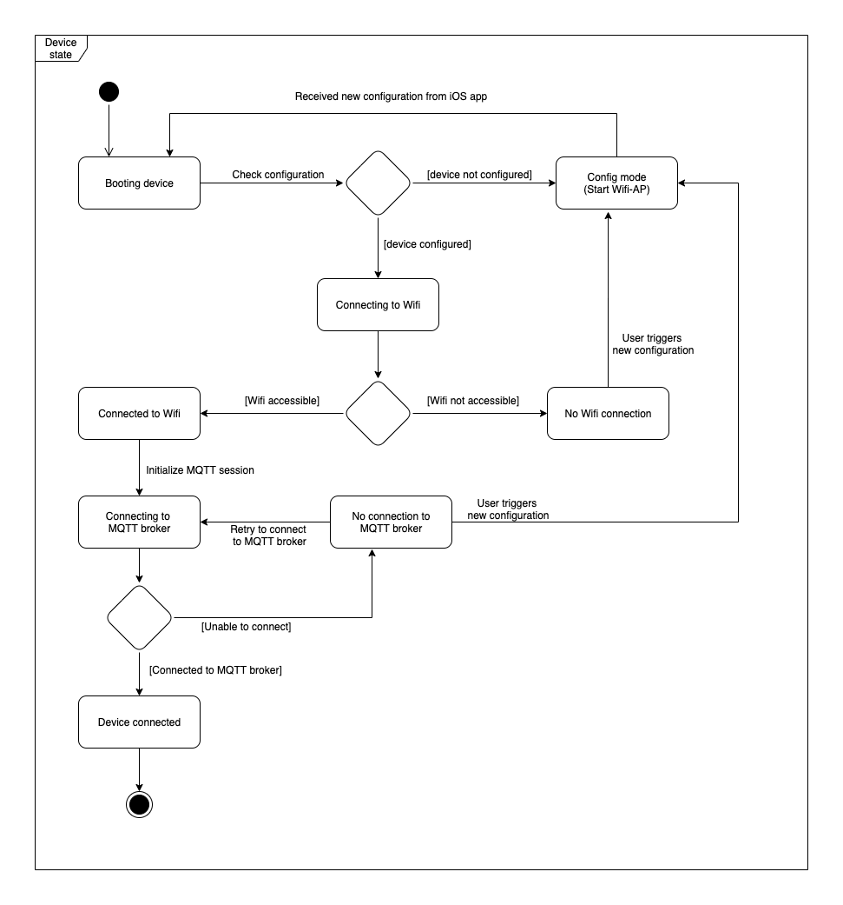
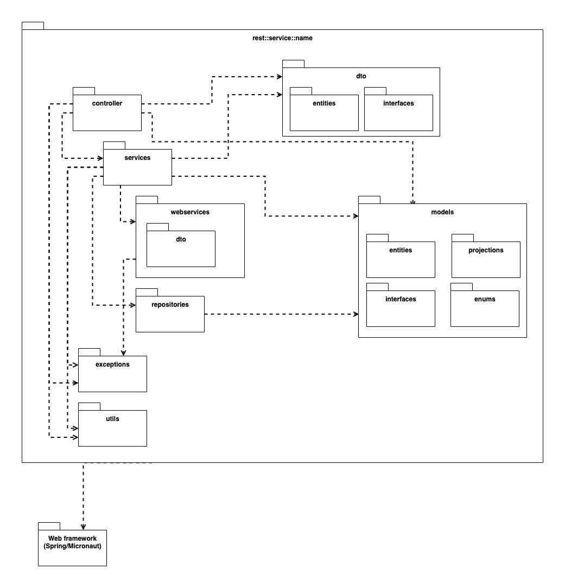
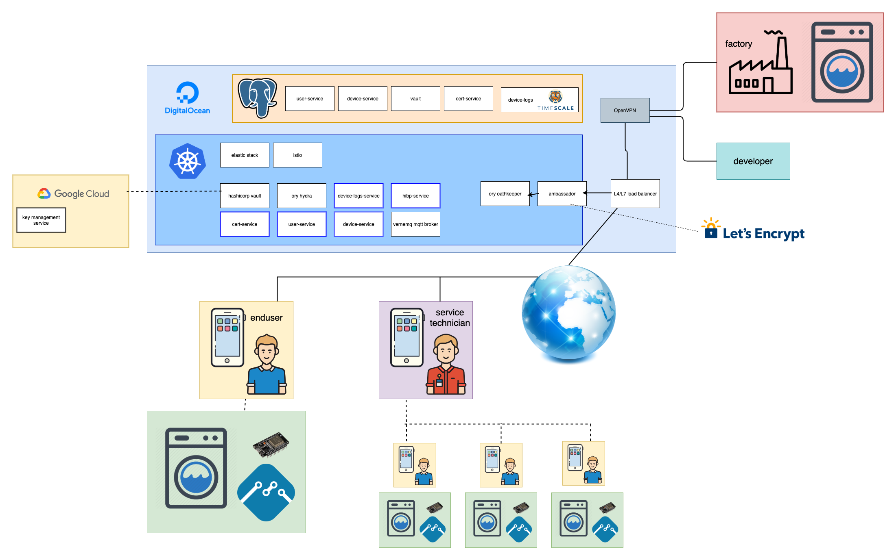
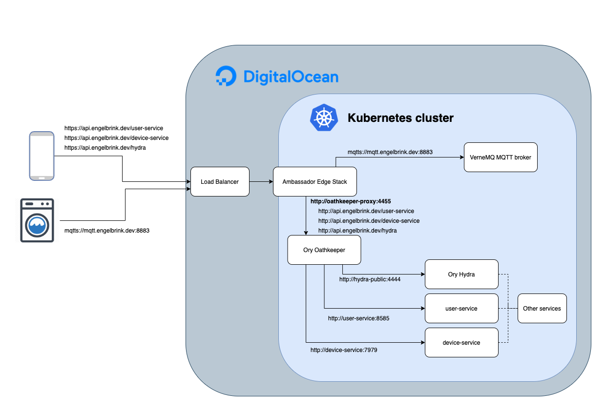
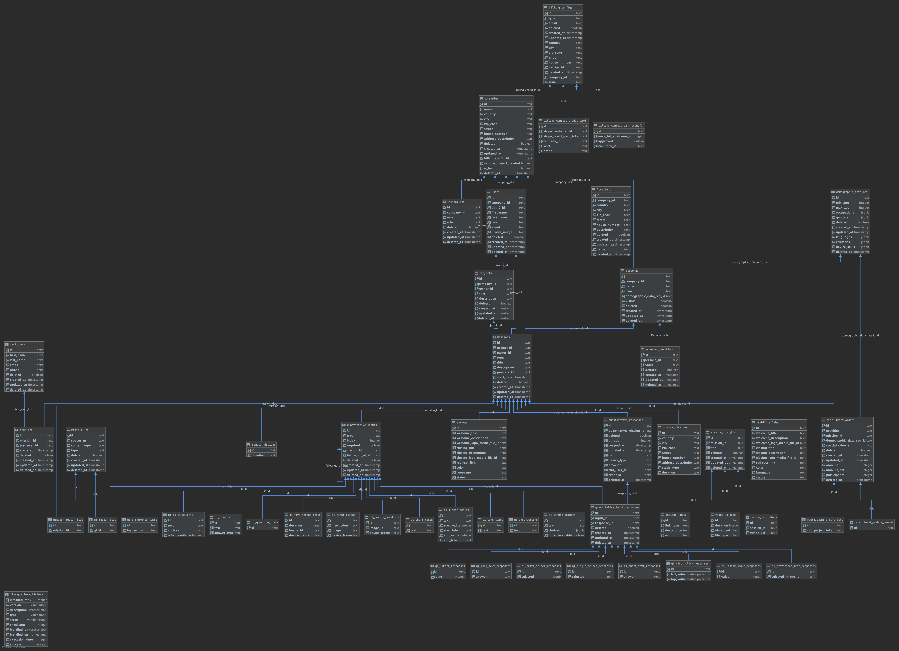

# SE35 - Software Modeling and Design Patterns

## 1. Diagrams

Diagrams can help to document and visualize the structure of a software project. One standardized way to describe specific parts of a software project is the Unified Modeling Language (UML) which is a standardized framework to visualize the structure/design of a software project. Additionally, you can also use other diagrams like ERD's or custom diagrams. In the next sections, I will describe some diagrams I have used during my project/in the past.

### 1.1 UML Sequence Diagram

The UML sequence diagram describes the communication between different parts of a system/different systems in time sequence. Furthermore, it helps to get an overview of which parts are communicating with each other in which order.

#### 1.1.1 OAuth2 flow
The following diagram explains the OAuth2 authentication flow in my application which is used to authenticate the user and receive access tokens to access protected resources:

<br/>

#### 1.1.2 MQTT authentication flow
The following diagram explains the authentication flow which is executed whenever a new client wants to connect to the MQTT broker:

<br/>

#### 1.1.3 Initialize device flow
This diagram describes the flow which is done during the production of an IoT device from the factory to initialize a new device in the system:

<br/>

#### 1.1.4 Device-claim flow
The following diagram describes the process of claiming an IoT device for a specific user who bought the device and wants to set it up:

<br/>

### 1.2 UML State Diagram
UML state diagram describes all possible states in which a software component can be in/transitioned to. This helps to get an overview of which events can happen to a component and what these events will change.

#### 1.2.1 App login states
The following diagram visualizes the states and event that can occur during the user login in the iOS app:

<br/>

#### 1.2.2 IoT device states
This diagram visualizes the possible states and state transitions of the IoT device:

<br/>

### 1.3 UML Package Diagram
The following package diagram shows a template of how I tried to structure all my REST API microservices which are implemented in Kotlin. This diagram describes the package structure so that all microservices share the same package structure and it is easy for other developers to work on different microservices without spending time on getting familiar with the project structure:

<br/>

### 1.4 UML Class Diagram
TODO
<br/>

### 1.5 Custom diagrams
Despite the standardized UML diagrams I also used some custom diagrams to visualize some architectural concepts of my project. 

#### 1.5.1 General project architecture
The following diagram visualizes the overall architecture and all components of my project:

<br/>

#### 1.5.2 Cluster inbound network traffic
This diagram visualizes the network traffic routes into the Kubernetes cluster:

<br/>

### 1.6 Entity-Relationship-Diagram (ERD)
The Entity-Relationship-Diagram helps to visualize entities and their relationships with each other. This diagram is often used to visualize the database design for relational databases.

The services in my current project were very small and only had 2-3 entities so the ERDs were not necessary but I had a bigger database in a previous project. This is a screenshot of DataGrip and it is hard to see everything in this picture but if you use DataGrip to visualize the ERD it is possible to scroll and zoom in and out:
<br/>

<br/>

## 2. Design patterns
Design patterns in software development are standardized solutions for common problems that occur during the development process. They help to structure your code and make it easier to maintain because you reduce replicated code. 

I have implemented most of these patterns in the [device-service repository](https://github.com/henrikengelbrink/se35-device-service).

### 2.1 Creational patterns
Creational patterns provide functionalities and solutions to create objects.

#### 2.1.1 Factory Method
The Factory Method pattern uses a single method to create objects of a specific interface instead of using the constructor directly. If you add another class that implements the interface at a later point of the project you don't need to change code in a lot of places but you only have to update the factory method to create objects of this new class. The factory method itself determines the specific class to create during the runtime.

I've used this pattern during the [JSON deserialization for the CreateDeviceDTO interface](https://github.com/henrikengelbrink/se35-device-service/blob/master/src/main/kotlin/se35/device/service/utils/CreateDeviceDTODeserializer.kt). Depending on the type of the incoming JSON body I am creating either an object of the class `CreateWashingMachineDTO` or of the class `CreateDryerDTO`. If I want to add an additional DeviceType later I only have to implement the Interface `CreateDeviceDTO` and add the constructor for this new class in the deserialize method of the `CreateDeviceDTODeserializer` class.
<br/>

#### 2.1.2 Abstract Factory
This pattern provides the functionality to create objects of similar classes without using the concrete class directly. The idea is to use an interface that defines the creation methods and the implemented classes need to implement the specific logic depending on their use-case. This decision in which specific implementation should be used is taken during the runtime.

In my case, I am using this pattern to build a converter that converts database objects of the class `Device` into their data transfer objects (DTO's) and vice versa. The interface [`DeviceDTOEntityConverter`](https://github.com/henrikengelbrink/se35-device-service/blob/master/src/main/kotlin/se35/device/service/utils/DeviceDTOEntityConverter.kt) defines the converting methods which are necessary and the implementations ([`WashingMachineDTOEntityConverter`](https://github.com/henrikengelbrink/se35-device-service/blob/master/src/main/kotlin/se35/device/service/utils/WashingMachineDTOEntityConverter.kt), [`DryerDTOEntityConverter`](https://github.com/henrikengelbrink/se35-device-service/blob/master/src/main/kotlin/se35/device/service/utils/DryerDTOEntityConverter.kt)) providing the actual logic for each device. Through this approach, it is possible to define which attributes of the database model should be contained in the DTO and we have a standardized interface for all `Devices` how to convert them.
<br/>

#### 2.1.3 Builder
The builder pattern is used to create objects that can be created in different types. Normally you can overload the constructor of the class to achieve the same functionality but this can become quite messy at some point.

To show a basic implementation of the builder pattern I've implemented the [`Subscription`](https://github.com/henrikengelbrink/se35-device-service/blob/master/src/main/kotlin/se35/device/service/models/entities/Subscription.kt) class in my project but this class is not actively used at the moment.
<br/>

#### 2.1.4 Prototype
The intend of the prototype pattern is to create objects from already existing objects without caring about their class.

Kotlin offers the `Cloneable` interface for this which implements exactly this functionality. I have [used this interface](https://github.com/henrikengelbrink/se35-device-service/blob/master/src/main/kotlin/se35/device/service/models/interfaces/Device.kt#L6) for the `Device` interface and [implemented the clone method](https://github.com/henrikengelbrink/se35-device-service/blob/master/src/main/kotlin/se35/device/service/models/interfaces/Device.kt#L11-L14) which clones the existing object and generates a new UUID for it.
<br/>

#### 2.1.5 Singleton
The singleton pattern lets you create a class and ensure that only one instance of this class is created and used globally.

This pattern is implemented natively in Kotlin with the `object` data type. I have used this pattern for the [`DateExtension` class](https://github.com/henrikengelbrink/se35-device-service/blob/master/src/main/kotlin/se35/device/service/utils/DateExtension.kt)
<br/>

#### 2.1.6 Dependency Injection
TBD.
<br/>


### 2.2 Structural patterns
Structural patterns help to arrange the structure between objects and their classes by keeping them flexible and easy to expand/maintain.

#### 2.2.1 Adapter
This pattern allows interaction between objects that are not based on the same interface.

In my project, I have used this pattern to show the water usage during a washing cycle of a washing machine. This value is stored in the database for every washing cycle and I am using liters as a unit of measurement for this. This works for all customers in Europe but US customers are not familiar with liters but they are using gallons so there is a need to deliver the value to them in a different unit of measurement. Therefore I have implemented the [`WaterUsage` interface](https://github.com/henrikengelbrink/se35-device-service/blob/master/src/main/kotlin/se35/device/service/models/interfaces/WaterUsage.kt) and its subclasses [`WaterUsageLiter`](https://github.com/henrikengelbrink/se35-device-service/blob/master/src/main/kotlin/se35/device/service/models/entities/WaterUsageLiter.kt) and [`WaterUsageGallon`](https://github.com/henrikengelbrink/se35-device-service/blob/master/src/main/kotlin/se35/device/service/models/entities/WaterUsageGallon.kt). These classes contain the functionality to convert the water usage between liter and gallons.
<br/>

#### 2.2.2 Flyweight
The idea of the flyweight pattern is to reduce the RAM usage of an application by removing duplicated/repeating attributes from a set of objects that share specific attributes.

I implemented a flyweight for theoretical purposes in this project. [By default, I was loading the entire `WashingMachineCycle` object from the database into the application](https://github.com/henrikengelbrink/se35-device-service/blob/master/src/main/kotlin/se35/device/service/repositories/WashingCycleRepository.kt#L13). The `WashingMachineCycle` class has a property called [`machine`](https://github.com/henrikengelbrink/se35-device-service/blob/master/src/main/kotlin/se35/device/service/models/entities/WashingCycle.kt#L6) which is automatically mapped by the ORM. This means in case I am loading millions of `WashingMachineCycle` objects for a specific machine this machine attribute is repeating in every object which means additional RAM usage. To reduce this RAM usage, I implemented the [`WashingCycleFlyweight` interface](https://github.com/henrikengelbrink/se35-device-service/blob/master/src/main/kotlin/se35/device/service/models/projection/WashingCycleFlyweight.kt) which is a projection, it means the ORM only loads specific fields from the database table. In this case, I am only loading the `id`, `start`, `end` and `waterUsage` and the machine is not loaded anymore, because I am [caching the machine object at the point where I am loading all the washing cycles for this specific machine](https://github.com/henrikengelbrink/se35-device-service/blob/master/src/main/kotlin/se35/device/service/services/WashingMachineService.kt#L15).

In this example, the additional complexity and computing power are not really worth using the flyweight because there will be never the case that one specific machine will have thousands of washing cycles, so this flyweight implementation is only meant for demo purposes.
<br/>

#### 2.2.3 Facade
The facade pattern is a way to hide the complexity of a library/framework by providing an easier to use interface that only provides basic functionalities.

I have not implemented any facade in the project by myself because all services and the iOS app is very simple and there was no need for it, but I've used the [`KeychainAccess` framework](https://github.com/kishikawakatsumi/KeychainAccess) which is a simple and easy implementation of the [iOS Keychain Services](https://developer.apple.com/documentation/security/keychain_services).

Furthermore, I am using an API Gateway for several microservices in my backend and the client (iOS App) has only one endpoint (https://api.engelbrink.dev) where it sends requests to. The API Gateway acts as a facade for an external system in this case because it hides the complexity of multiple services by providing only a simple interface for the iOS app. [This article](https://freecontent.manning.com/the-api-gateway-pattern/) describes this a little bit more.
<br/>

#### 2.2.4 Decorator
The decorator pattern offers the possibility to update or expand the functionality of objects during the runtime of the application. This is done by implementing a wrapper class around the object which changes the existing functionality.

Unfortunately, there were no uses cases for this pattern in my project but I have implemented a trivial example version of it to show how this pattern is working:

```
interface Product {
    val id: UUID
    ...
    fun executeThat()
    fun doThis()
    fun handleStuff()
}

class ProductA: Product {

    override val id = UUID.randomUUID()

    override fun executeThat() {
        print("executeThat for ProductA")
    }

    override fun doThis() {
        print("doThis for ProductA")
    }

    override fun handleStuff() {
        print("handleStuff for ProductA")
    }

}
```

Now we want to create a `ProductB` which uses some of the functionalities of `ProductA` but it should also have some additional methods:
```
class ProductB(
    val product: Product
): Product by product {

    override executeThat() {
        println("Additional stuff executeThat in ProductB")
        product.executeThat()
    }

    override fun doThis() {
        print("total override of doThis of ProductA in ProductB")
    }

    fun additionalStuff() {
        print("Do additional stuff of ProductB")
    }

}

val productA = ProductA()
val productB = ProductB(productA)

productB.executeThat()
productB.doThis()
productB.handleStuff()
productB.additionalStuff()

```


### 2.3 Behavioral patterns
#### 2.3.1 Command
#### 2.3.2 Observer
#### 2.3.3 State
#### 2.3.4 Visitor
